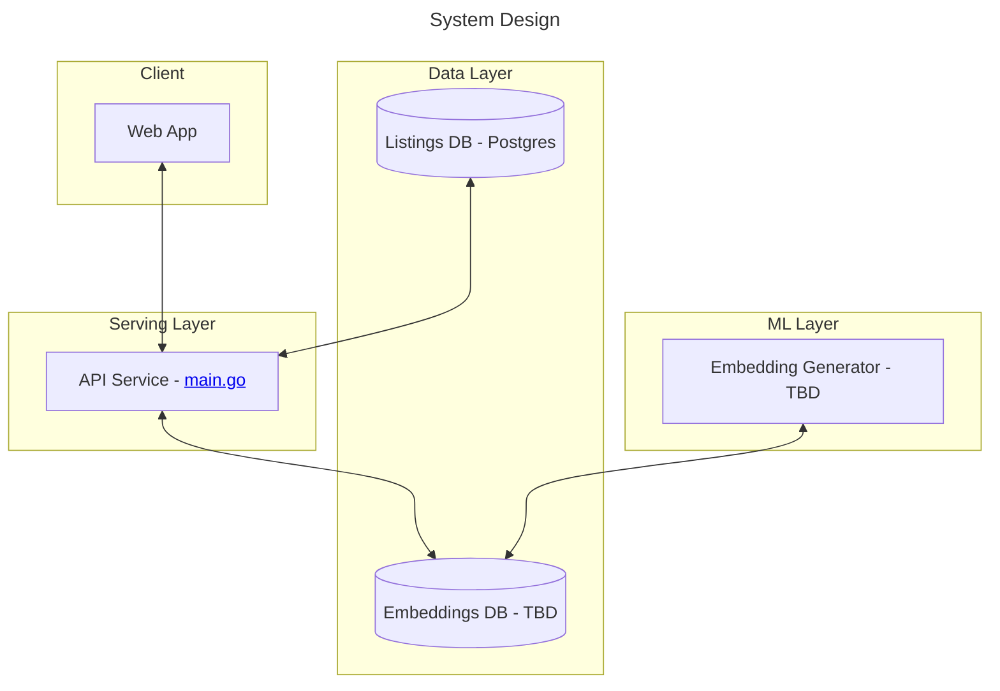
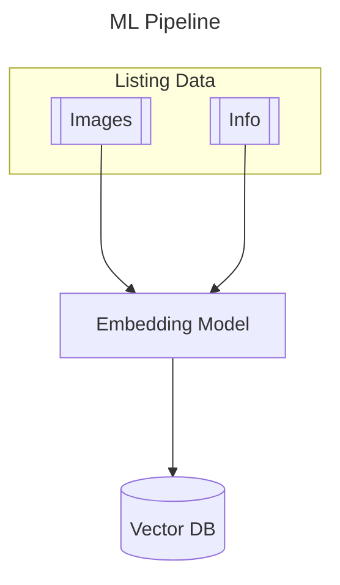

```mermaid
---
title: System Design
---

flowchart TB

subgraph Client 
    client_app[Web App]
end

subgraph Serving Layer
    api[API Service - <a href='https://github.com/BeyCoder/SemanticListingSearch/blob/main/main.go'>main.go</a>]
end

subgraph Data Layer 
    db[(Listings DB - Postgres)]
    embeddings_db[(Embeddings DB - TBD)]
end

subgraph ML Layer
    embedding_generator[Embedding Generator - TBD]
end

client_app<--->api
db<--->api<--->embeddings_db
embedding_generator<--->embeddings_db
```

```mermaid
---
title: ML Pipeline
---

flowchart TB

subgraph Listing Data
    listing_info[[Info]]
    listing_image[[Images]]
end

embedding_model[Embedding Model]
db[(Vector DB)]

listing_image--->embedding_model--->db
listing_info--->embedding_model

```